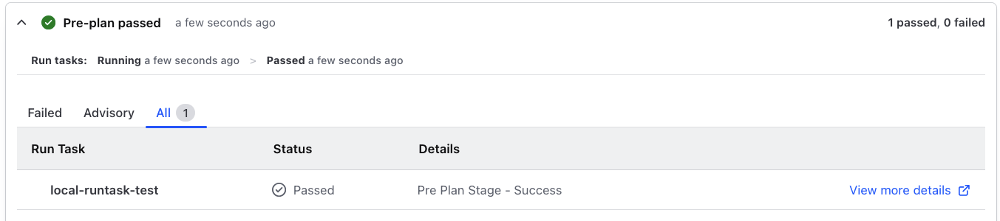
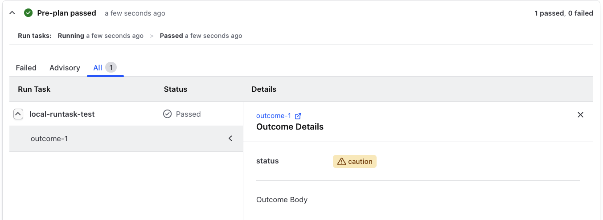
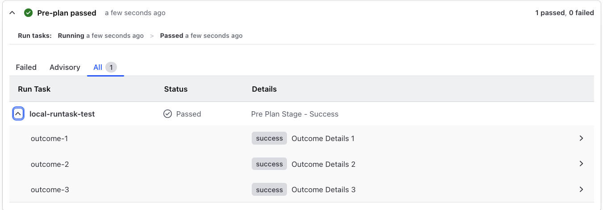

# Displaying Run Task Results

When a Run Task is executed, it can return a status to indicate whether it succeeded or failed, but beyond that there are several options (and gotchas) to be aware of.

All the logic explained here is implemented in the file [`internal/api/task_response.go`](internal/api/task_response.go) and uses a fluent style function chaining approach.

For more details of the API used to set the Run Task response, see the [Run Task Callback API](https://developer.hashicorp.com/terraform/enterprise/api-docs/run-tasks/run-tasks-integration#run-task-callback).

## Simple Success/Failure

Let's start with the most basic case where we have 'status' and 'message' set in the response.

> [!NOTE]
> In the screenshots below "local-runtask-test" is the name of the Run Task set by the admin who created the Run Task in the Organization.

### Message Set

If 'message' is set, it will be displayed in the UI as part of the Run Task result:


Code snippet to set status and message:

```go
ntr := api.NewTaskResponse()
ntr.SetResult(api.TaskPassed, "Pre Plan Stage - Success")
```

### Message Not Set

If 'message' is not set, only the status will be shown:


```go
ntr := api.NewTaskResponse()
ntr.SetResult(api.TaskPassed, "")
```

### URL Set

It is also possible to add a URL to the result, which will be shown as as a hyperlink:



## Using Outcomes

Outcomes are a way to provide more detailed information about the Run Task execution.

They can include the following:

- 'outcome id' - a unique identifier for the outcome
- 'description' - a brief description of the outcome (should be short)
- 'body' - a more detailed description of the outcome (can be longer)
- 'url' - a link to more information about the outcome (must begin with http:// or https://)

### Simple Outcome

A simple case can be seen here:


and if we expand the outcome:


```go
ntr := api.NewTaskResponse()
ntr.AddOutcome("outcome-1", "Outcome Details", "Outcome Body", "", "success", api.TagLevelNone)
ntr.SetResult(api.TaskPassed, "Pre Plan Stage - Success")
```

### Simple Outcome with URL

You can also add a URL to the outcome:


```go
ntr := api.NewTaskResponse()
ntr.AddOutcome("outcome-1", "Outcome Details", "Outcome Body", "https://example.com", "success", api.TagLevelNone)
ntr.SetResult(api.TaskPassed, "Pre Plan Stage - Success")
```

### Tags

Outcomes can have different tags to indicate additional information about the outcome. The examples so far have used a tag called "status" already.

You do have options what the label of the tag is, and you can also use multiple tags.

Here is another example where we set the tag to the "warning" icon with the string name "caution":




```go
ntr := api.NewTaskResponse()
ntr.AddOutcome("outcome-1", "Outcome Details", "Outcome Body", "https://example.com", "caution", api.TagLevelWarning)
ntr.SetResult(api.TaskPassed, "Pre Plan Stage - Success")
```

### Multiple Outcomes

You can also add multiple outcomes to a single Run Task response.



```go
ntr := api.NewTaskResponse()
ntr.AddOutcome("outcome-1", "Outcome Details 1", "Outcome Body", "", "success", api.TagLevelNone)
ntr.AddOutcome("outcome-2", "Outcome Details 2", "Outcome Body", "", "success", api.TagLevelNone)
ntr.AddOutcome("outcome-3", "Outcome Details 3", "Outcome Body", "", "success", api.TagLevelNone)
ntr.SetResult(api.TaskPassed, "Pre Plan Stage - Success")
```

## Common Issues

Any URL set either at the Task level or the Outcome level must begin with http:// or https://.

If it does not, the UI will not display task result properly.

Take this example (note example.com does not begin with http:// or https://):

```go
ntr := api.NewTaskResponse()
ntr.AddOutcome("outcome-1", "Outcome Details", "Outcome Body", "example.com", "success", api.TagLevelNone)
ntr.SetResult(api.TaskPassed, "Pre Plan Stage - Success")
```

The UI will display it like this:


