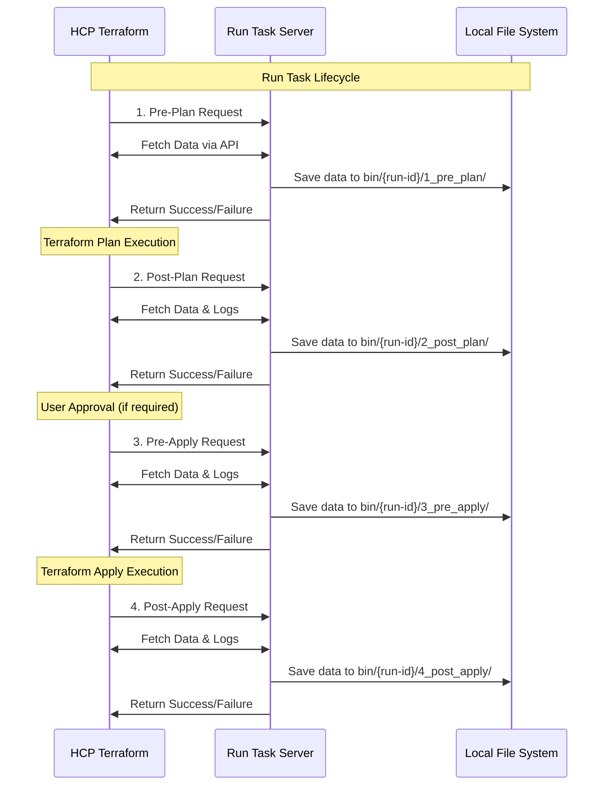

# Terraform Run Task - Getting Started

Want a hands-on, low-stakes way to learn Terraform Run Tasks? This repo is your sandbox.

We build a small, playful Run Task that doesn’t enforce policy or block runs. It listens at each lifecycle stage and captures useful artifacts and API responses so you can explore exactly what Terraform exposes along the way.

Think of it as a flight recorder for your runs—not an air-traffic controller. It fetches and saves config files, plans, logs, and run metadata in a tidy folder layout.

Use it to learn the Run Task workflow end to end or as a starting point for your own tasks. It covers all four stages: pre-plan, post-plan, pre-apply, and post-apply.

## What is a Terraform Run Task?

Run tasks are custom HTTP services that HCP Terraform or Terraform Enterprise can call during specific stages of a Terraform run. They enable you to integrate custom validation, compliance checks, notifications, or any other logic into your Terraform workflow.

> [!important]
> This documentation focuses on HCP Terraform, but the concepts and code can be adapted for Terraform Enterprise as well.

## Architecture Overview



## Features

- **Full Stage Coverage**: Implements all four run task stages (pre-plan, post-plan, pre-apply, post-apply)
- **Data Collection**: Automatically downloads and saves relevant data from HCP Terraform APIs at each stage
- **Local Development**: Uses Cloudflare Tunnel to expose your local server to HCP Terraform
- **Structured Output**: Organizes collected data in a clear directory structure for easy exploration
- **Task Automation**: Includes Task runner configuration for streamlined development workflow

## What Data is Available?

This run task demonstrates the wealth of information available at each stage.

### All Stages

- **Request payload**: The initial request from HCP Terraform (`request.json`)
- **Response payload**: The response the Run Task sent to HCP Terraform (`response.json`)
- **Run details**: Basic information about the Terraform run (`run_api.json`)

### Pre-Plan Stage

- **Configuration files**: The actual Terraform code being executed (`{config-version-id}.tar.gz` and `{config-version-id}/`)

> [!note]
> Files are found at `bin/local-runtask-test/run-{run-id}/1_pre_plan/`

### Post-Plan Stage

- **Configuration files**: The actual Terraform code being executed (`{config-version-id}.tar.gz` and `{config-version-id}/`)
- **Terraform plan**: The Terraform plan in JSON format (`plan_json.json`)
- **Plan details**: Basic information about the Plan (`plan_api.json`)
- **Plan logs**: Detailed logs from Terraform Plan (`plan_logs.txt`)

> [!note]
> Files are found at `bin/local-runtask-test/run-{run-id}/2_post_plan/`

### Pre-Apply Stage

- **Policy-check details**: Basic information about any policy checks (`policy-checks_api.json`)
- **Comments details**: Any comments added to the run (`comments_api.json`)
- **Task-stages details**: Basic information about the run task stages (`task_stages_api.json`)
- **Run-events details**: Basic information about the run events (`run_events_api.json`)

> [!note]
> Files are found at `bin/local-runtask-test/run-{run-id}/3_pre_apply/`

### Post-Apply Stage

- **Apply details**: Basic information about the Apply (`apply_api.json`)
- **Apply logs**: Detailed logs from the Apply (`apply_logs.txt`)
- **Policy-check details**: Basic information about any policy checks (`policy-checks_api.json`)
- **Comments details**: Any comments added to the run (`comments_api.json`)
- **Task-stages details**: Basic information about the run task stages (`task_stages_api.json`)
- **Run-events details**: Basic information about the run events (`run_events_api.json`)

> [!note]
> Files are found at `bin/local-runtask-test/run-{run-id}/4_post_apply/`

## Prerequisites

Before getting started, make sure you have:

- **Go 1.25+** installed (previous versions may work but not tested)
- **Cloudflare CLI** (`cloudflared`) - install via `brew install cloudflared` on macOS
- **Terraform** with access to HCP Terraform or Terraform Enterprise
- An **HCP Terraform organization** where you can create workspaces and run tasks
- (optional) **Task** (task runner) - install via `brew install go-task/tap/go-task` on macOS

## Quick Start

### Step 0: Set Up Environment

Create a `.env` file in the project root with the following content:

```env
TERRAFORM_API_TOKEN=your_hcp_terraform_api_token_here
```

This will be set when running the Task commands (or you can `export` yourself).

### Step 1: Build and Run the Server

The run task is implemented as a simple Go web server. Use the included Task runner commands:

```bash
# Generate HMAC key for secure communication
# This will generate a key and save it to bin/hmac.key, that file is used when starting the server 
# And running the setup via Terraform
task generate-hmac

# Build the Go application
task build

# Run the server (runs on port 22180 by default)
task run
```

The server will start and listen for incoming requests from HCP Terraform.

### Step 2: Expose Your Local Server

Since HCP Terraform needs to reach your local server, we use Cloudflare Tunnel to create a public endpoint:

```bash
# Start the tunnel (runs in background)
task tunnel-start

# Check if everything is working
task healthcheck
```

The tunnel URL will be automatically saved to `bin/tunnel/tunnel.url` for use in the next step.

### Step 3: Set Up HCP Terraform Resources

Navigate to the setup directory and run Terraform to create the necessary resources:

```bash
cd test/setup

# Update the organization name in main.tf to match your HCP Terraform org
# Then initialize and apply
terraform init
terraform apply
```

This will create:

- A run task in your HCP Terraform organization
- A test workspace
- The association between the workspace and run task

### Step 4: Trigger a Test Run

Now run Terraform in the test workspace to see the run task in action:

```bash
cd test/run
terraform init
terraform plan
terraform apply
```

### Step 5: Explore the Generated Data

After the run completes, check the `bin/local-runtask-test/` directory. You'll find a folder for each run with subdirectories for each stage:

```text
bin/local-runtask-test/
└── run-{run-id}/
    ├── 1_pre_plan/
    │   ├── request.json    
    │   ├── response.json
    │   ├── run_api.json
    │   ├── cv-{version-id}.tar.gz
    │   └── cv-{version-id}/
    ├── 2_post_plan/
    │   ├── plan_json.json
    │   ├── plan_logs.txt
    │   └── ...
    ├── 3_pre_apply/
    │   ├── policy-checks_api.json
    │   ├── comments_api.json
    │   └── ...
    └── 4_post_apply/
        ├── apply_api.json
        ├── apply_logs.txt
        └── ...
```

## Development Tips

### Customizing the Run Task

The main run task logic is in `internal/runtask/run_task_stages.go`. Each stage method shows you:

- How to receive the request from HCP Terraform
- What APIs are available to call back to HCP Terraform
- How to return success/failure responses

### Configuration

The run task server accepts these command-line flags:

- `-port`: Server port (default: 22180)
- `-path`: URL path for requests (default: /runtask)
- `-hmacKey`: HMAC key for request validation

### Debugging

- Check `bin/tunnel/tunnel.log` for tunnel connection issues
- Server logs will show incoming requests and processing details
- The generated JSON files contain the exact data HCP Terraform sends

## Next Steps

Once you understand how the run task works, you can:

1. **Add custom logic** to any of the four stage methods
2. **Integrate with external systems** (monitoring, ticketing, etc.)
3. **Implement validation rules** based on the plan data
4. **Send notifications** about infrastructure changes
5. **Create compliance reports** using the policy check data

The beauty of run tasks is that you have access to the full Terraform context and can make decisions or take actions at the perfect moment in the workflow.

## Troubleshooting

### Terraform Failures

If the `test/setup` Terraform fails during apply creating the run task, be sure that the webserver and tunnel are running and accessible.
HCP Terraform will perform a health check on the run task URL when creating the association and if it cannot reach the URL, the creation will fail.

### Run Task Not Triggered

- Verify the tunnel is running and accessible via `task healthcheck`
- Check that the workspace is properly associated with the run task
- Ensure the HMAC key matches between the server and HCP Terraform

### Authentication Issues

- Verify your `TERRAFORM_API_TOKEN` environment variable is set correctly
- Check that your token has sufficient permissions for the organization

### Network Issues

- Ensure cloudflared is installed and working
- Check firewall settings if the tunnel can't start

## References

- [Terraform Cloud Run Tasks](https://developer.hashicorp.com/terraform/cloud-docs/workspaces/settings/run-tasks)
- [Terraform Enterprise Run Tasks](https://developer.hashicorp.com/terraform/enterprise/workspaces/settings/run-tasks)
- [Creating a Run Task](https://developer.hashicorp.com/terraform/cloud-docs/workspaces/settings/run-tasks#creating-a-run-task)
- [Associating Run Tasks with a Workspace](https://developer.hashicorp.com/terraform/cloud-docs/workspaces/settings/run-tasks#associating-run-tasks-with-a-workspace)
- [Run Task API Reference](https://developer.hashicorp.com/terraform/cloud-docs/api-docs/run-tasks)
- [Cloudflare Tunnel Documentation](https://developers.cloudflare.com/cloudflare-one/connections/connect-apps/)
